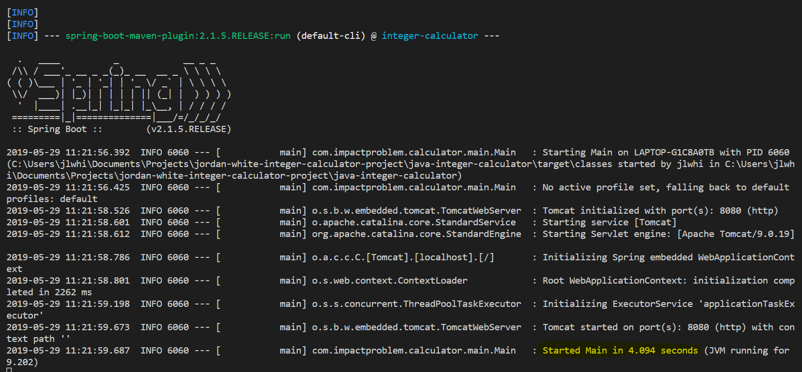
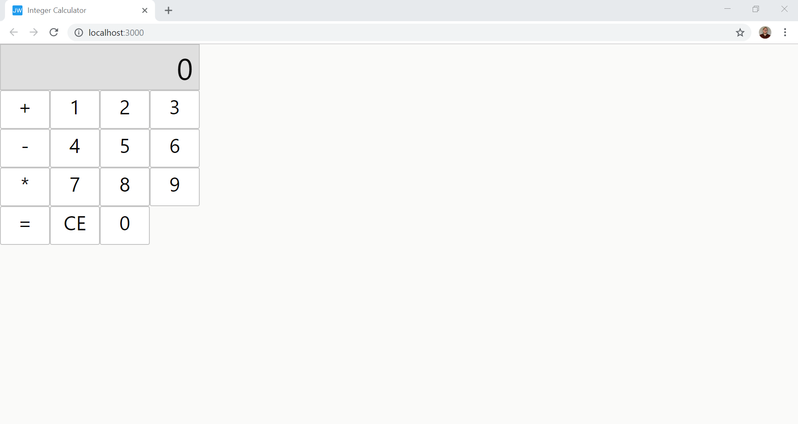

# Integer Calculator Instructions

## `DESCRIPTION`

(View in Preview mode, to see screenshots.)

This code project is a simple integer calculator. As one might guess, it adds, subtracts, and multiplies any two single-digit integers. It also contains a `clear` button to reset the calculator when desired or in the event of edge cases.

The frontend is a React application which calls to a Java API running in the backend.

## `SETUP`

This project requires localhost:8080 and localhost:3000 to be unused. They should be the defaults, so assuming nothing else is running, you shouldn't encounter errors relating to this. If you do, consult the instructions at the bottom to clear them both for use.

1. First, unzip the parent folder containing "java-integer-calculator" and "react-integer-calculator." You may place this folder anywhere you like as long as you know the location for a future step.

2. Next, you'll need to run some commands in a CLI. I use VS Code because setup requires two terminals and VS Code has a nice split terminal feature:

3. In one terminal, CD to the location of the Java project

and input the following command to begin running the backend: `mvn spring:boot-run`

If the final line, says "Started Main," it is successfully running.

If you got another result, likely localhost:8080 is currently in use. Please consult the section below to resolve this.
4. In the other terminal, CD to the location of the React project

and input the following command to begin running the frontend (first run `npm install` if you're missing dependencies): `npm start` 

If it successfully compiled, the calculator should have automatically opened in your browser at localhost:3000:

At this point, you may use the calculator as much as you want! 
5. To end either of the Java or React programs, simply type `ctrl + c` in the appropriate terminal and then press `y` and then `enter` to terminate.

## `CONNECTION TROUBLESHOOTING`

If localhost:8080 and/or localhost:3000 are in use, follow these steps to terminate the active connections:

1. Open command line and input the command: `netstat -ano`

2. Look through the list to find the connections and make note of the PID numbers:

3. Run the following command for either or both active connection: `taskkill /F /PID [PID # goes here]`

4. Now you may run either program without issue